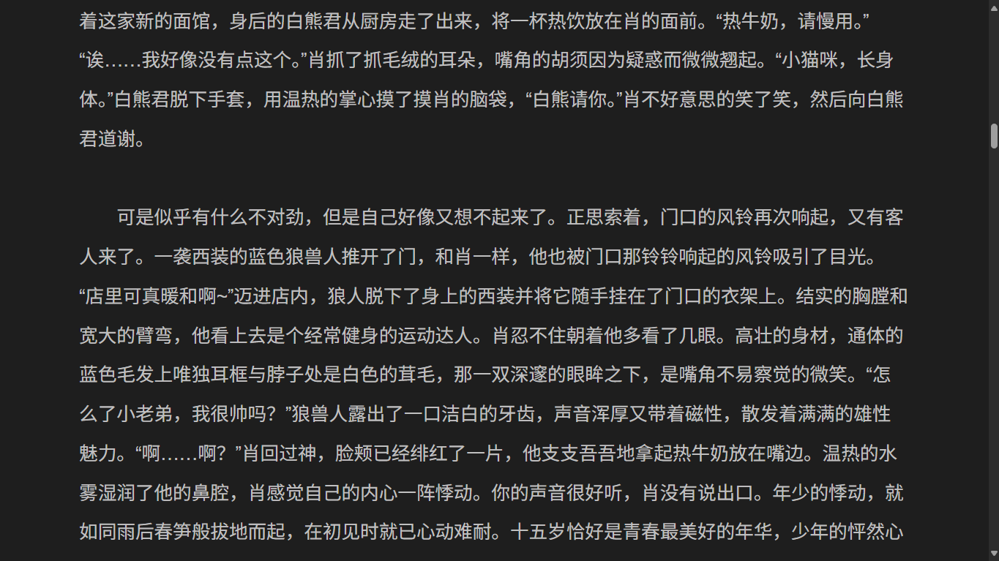

# 贴吧自动爬文脚本

### ——你还在忍受百度贴吧的勾式排版和龟速屎山吗？

- 基于 Python 3.12.10 + Selenium
- 模拟用户操作爬取并整合文贴
- 输出为单个美观的页面
- 为经常浏览文贴的小伙伴提供了一个较为优雅的解决方案

## 效果图

## 操作流程

详见👉[Bilibili](https://www.bilibili.com/video/BV1JPedzoETG)
